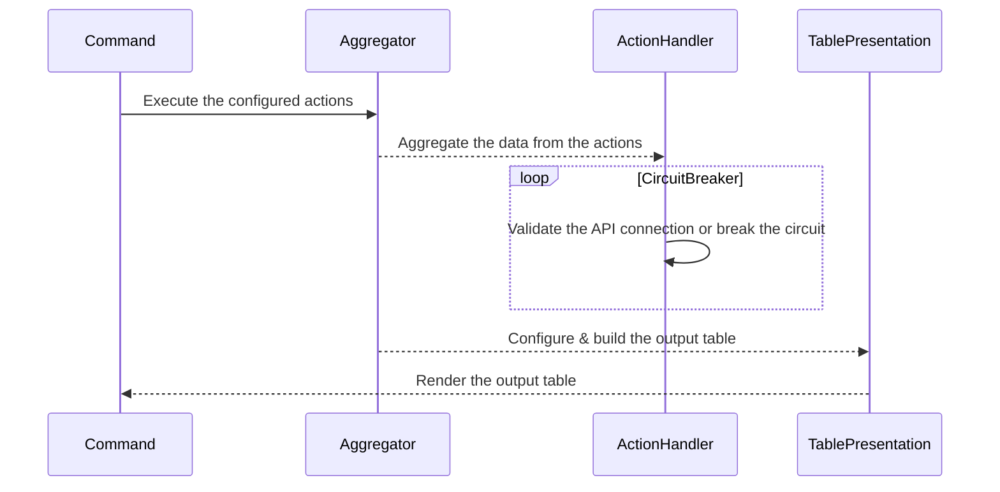

# My FX Book API CLI 🚀

### 👤 Login

The login command will trigger the login at MyFxBook and saves the session token into the inmemory database. \
The session token does not have a expiration time, therefore it is only required to login once.

```bash
./bin/console fx:login
```

### ⛓️‍💥 Logout

The logout command will delete the active session token from the inmemory database. \
If you decide to logout, you will need to login again to execute all other commands.

```bash
./bin/console fx:logout
```

### 📈 Daily data

Fetches the account data combined per day

```bash
./bin/console fx:daily-data
```

### 💰 Daily gains

Fetches the account gains combined per day

```bash
./bin/console fx:daily-gain
```

### 📊 Order history

Fetches all opened positions for each account

```bash
./bin/console fx:history
```

### 📈 Progress chart widget

Generates progress chart widgets for each account

```bash
./bin/console fx:widget
```

## ⚙️ Architecture


