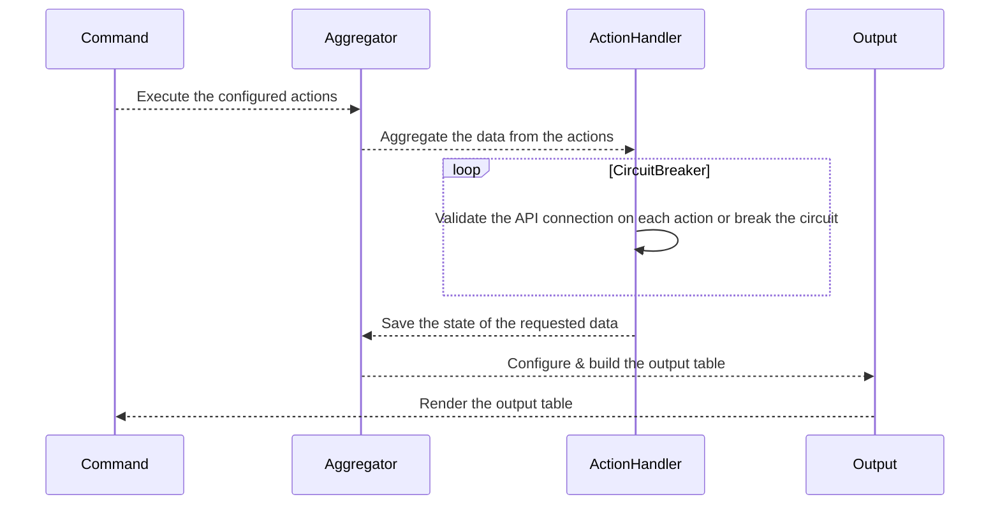

# My FX Book API CLI 🚀

### 👤 Login

The login command will trigger the login at MyFxBook and saves the session token into the inmemory database. \
The session token does not have a expiration time, therefore it is only required to login once.

```bash
./bin/console fx:login
```

### ⛓️‍💥 Logout

The logout command will delete the active session token from the inmemory database. \
If you decide to logout, you will need to login again to execute all other commands.

```bash
./bin/console fx:logout
```

### 📈 Daily data

Fetches the account data combined per day

```bash
./bin/console fx:daily-data

+------------+-----------+----------+--------+--------------+----------+---------------+---------------+
| Date       | Balance   | Pips     | Lots   | Floating P&L | Profit   | Growth equity | Floating pips |
+------------+-----------+----------+--------+--------------+----------+---------------+---------------+
| 02/05/2024 | 100000    | 0        | 0      | 0            | 0        | 0             | 0             |
| 02/07/2024 | 101666    | 2380     | 70     | 0            | 1666     | 1.67          | 0             |
| 02/09/2024 | 102353.5  | 1770     | 219.31 | 0            | 687.5    | 2.35          | 0             |
+------------+-----------+----------+--------+--------------+----------+---------------+---------------+
```

### 💰 Daily gains

Fetches the account gains combined per day

```bash
./bin/console fx:daily-gain

+------------+-------+----------+
| Date       | RRR   | Profit   |
+------------+-------+----------+
| 04/05/2024 | 2.79  | 5576.7   |
| 04/08/2024 | 4.31  | 3040     |
| 04/10/2024 | 6.89  | 5155.4   |
+------------+-------+----------+
```

### 📊 Order history

Fetches all opened positions for each account

```bash
./bin/console fx:history

+--------+--------+----------+-------------+----------+----------+-------+----------+
| Symbol | Lots   | Open     | Close       | TP       | SL       | Pips  | Profit   |
+--------+--------+----------+-------------+----------+----------+-------+----------+
| GBPUSD | 29.80  | 1.26859  | 1.27035     | 1.27034  | 0        | 17.6  | 5155.4   |
| EURUSD | 40.00  | 1.08337  | 1.08258     | 0        | 0        | 7.9   | 3040     |
| EURUSD | 38.46  | 1.0804   | 1.08188     | 0        | 0        | 14.8  | 5576.7   |
+--------+--------+----------+-------------+----------+----------+-------+----------+
```

### 📈 Progress chart widget

Generates progress chart widgets for each account

```bash
./bin/console fx:widget
```

## ⚙️ Architecture


